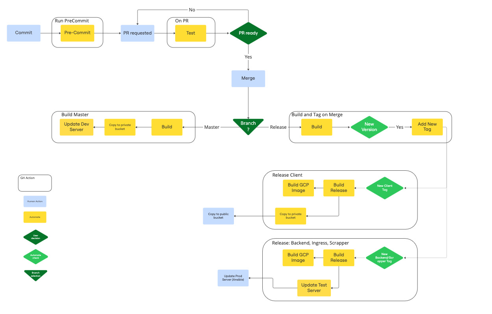

# GitHub Actions

_[Return](./README.md)_

Above diagram represents GHA workflows.
They use following components:
- pre-commit checks
- rust/cargo test, validate and build commands
- Git operations (tagging, code checkout, preparing relese)
- copying data to GCP buckets
- Ansible playbook runs
- GCP authentication actions (for moving files around & running Ansible)
- downloading required software (deb and pip packages, cargo tools)

_[Return](./README.md)_
